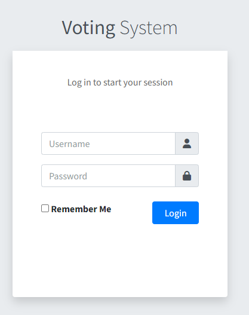
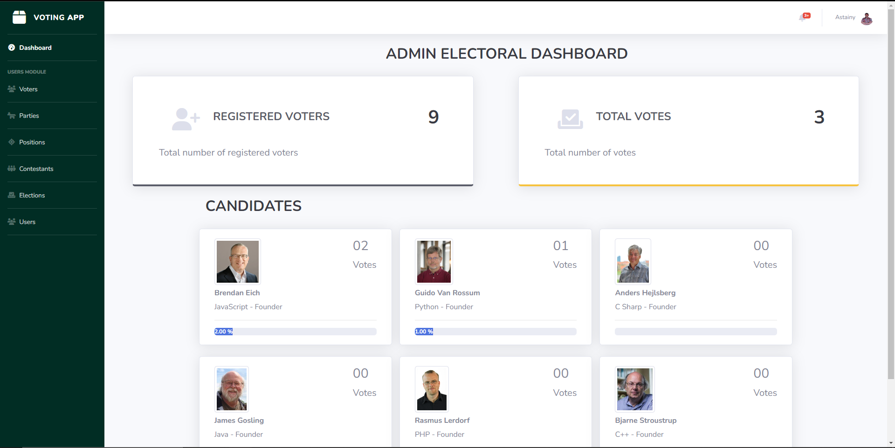
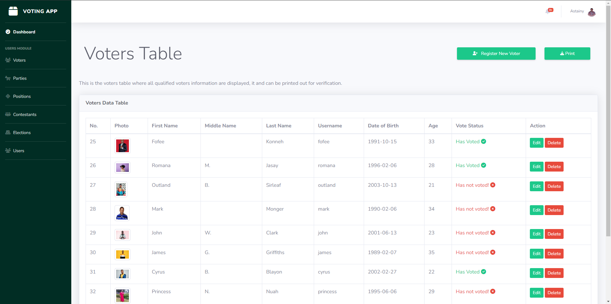
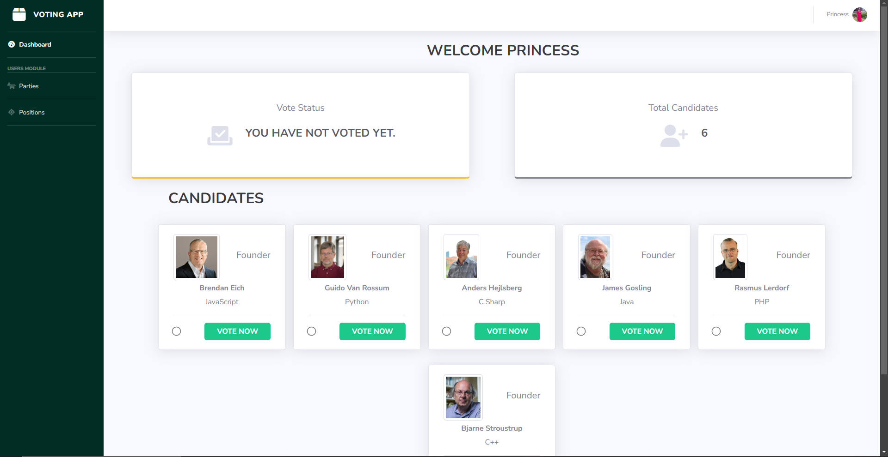
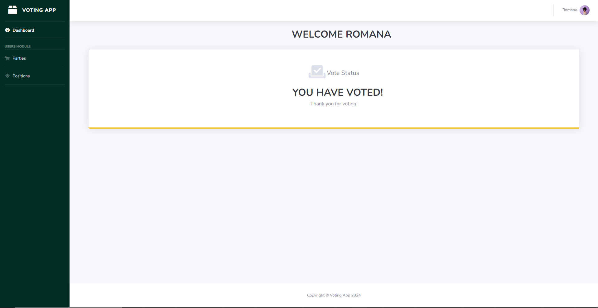

# [Voting App -  By Astainy]

## Preview

### Login Page

### Dashboard

### Voter List

### Candidate to be Voted

### Voted Page

## Status

## Download and Installation

To begin using this system, choose one of the following options to get started:

* Clone the repo: `git clone https://github.com/astainy1/election-app.git`
* [Fork, Clone, or Download on GitHub](https://github.com/astainy1/election-app.git)

## Usage

After installation, run `npm install` and then run `npm start` which will open up the project on [(http://localhost:500)] in your default browser, watch for changes to core project files, and live reload the browser when changes are saved.

You must have npm installed globally in order to use this build environment. This project was built using **node v10.7.0**

**[Login credentials]**

1. Admin
    username: admin
    password: 123456

2. Voter
    username: hawa
    password: 1234567

## Bugs and Issues

Have a bug or an issue with this project? [Open a new issue](https://github.com/astainy1/election-app/issues) here on GitHub or **[send me a mail](astainyharris1@gmail.com)**.

## About

Elections App is a practice project developed during my study at Orange Digital Center [ODC] Nodejs Fullstack Web Development Training. This project was built using the following technology

* --- **[Front End]** ---
* EJS - JavaScript templating engine
* CSS
* Bootstrap - CSS Library
* Venila Js

* --- **[Back End]** ---

* Node js - Development environment
* Express Js - Web framework for JavaScript
* SQLite3 - Database

The project aims to transition from traditional manual paper elections to a modern, secure online election platform that will streamline the voting process in real-time and making it accessible to all.

*[OUTCOME]*

This project helps me achieve the following:

* Understand how to work with relational databases
* Understand how to use SQL commands
* Understand how to create dynamic pages with ejs templating engine
* Get more familiar with nodejs routes
* Do more practice with EventListeners and DOMmanupulation
* Understand how to read Documentations
* Send and receive data to APIs using Fetch

**[Research](https://www.freecodecamp.org/news/javascript-fetch-api-for-beginners)**
**[Research](https://www.geeksforgeeks.org/javascript-fetch-method/)**

* Handle API responses and manipulate JSON Object
* Understand the different HTTP Methods
* Understand the asynchronous nature of JavaScript

This project is released under the MIT license, which means you can use it for any purpose, even for commercial projects.

* <https://astainy1.github.io/astainyportfolio>
* <https://web.facebook.com/christian.harris.58555>

Elections App was created by and is maintained by **[Christian Astainy Harris](https://github.com/astainy1)**.

* <https://github.com/astainy1>
* <https://web.facebook.com/christian.harris.58555>

## Copyright and License

Copyright 2024 Voting App LLC. Code released under the [MIT]() license.
